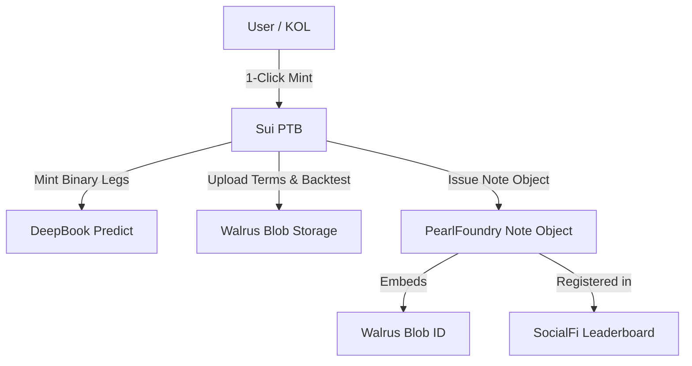

# 🌊 PearlFoundry

> **One-Click Structured Note Factory**  
> Track 2 · DeepBook & Prediction Markets · Sui Overflow 2026  
> HANDBOOK Pillar: **Vaults & Structured Products**

---

PearlFoundry is a one-click structured product issuance platform. It enables retail users, KOLs, and CeFi white-label partners to mint tokenised structured notes (Range Accrual, Capped-Upside, Principal-Protected) on Sui in a single Programmable Transaction Block (PTB). 

Under the hood, PearlFoundry packages multi-strike/multi-expiry **DeepBook Predict** binaries into a Move-object note, attests terms and backtest CSVs immutably onto **Walrus**, and ranks issuers via a SocialFi leaderboard by realised returns.

---

## 🛑 The Pain Points

1. **Bank Notes are Exclusive 🔒**  
   Traditional bank structured notes require $50k–$250k minimums, lockups, and heavy KYC, shutting out 90% of the retail market.
2. **First-Gen DOVs Collapsed 💥**  
   DeFi Option Vaults (DOVs) like Ribbon and Cega collapsed or sunsetted due to oracle manipulation, lack of real vol-surface pricing, and high gas fees.
3. **No Immutable Audit Trail 📝**  
   Traditional banks issue 60-page paper prospectuses, while DeFi vaults issue editable doc pages. Regulators and compliance teams cannot audit or underwrite either.

---

## 🐚 The PearlFoundry Solution

* **One-Click Multi-Leg Composition ⚡**  
  Bundle up to 24 adjacent option strikes and expiries using Sui's atomic Programmable Transaction Blocks (PTBs)—no leg-risk, slippage, or complex flash loans.
* **On-Chain Volatility Pricing 📊**  
  Liaise directly with DeepBook Predict's sub-hour SVI surface to price range accruals and call spreads natively.
* **Walrus-Backed Term Attestation 📜**  
  Every minted note generates an immutable term sheet and historical backtest CSV pinned to **Walrus**, storing the Blob ID directly inside the note's Move object for compliance.
* **SocialFi Leaderboard & SDK 🏆**  
  KOLs issue custom notes to followers to earn referral rebates and build a public track record ranked by realised APR. CeFi platforms can white-label the entire flow via our SDK.

---

## 💎 Supported Note Templates

* **📈 Range Accrual Note**  
  *Earn yield for every hour BTC/SUI stays within a specified range over a 7-day period. Principal is at risk if boundaries break.*
* **🎯 Capped-Upside Note**  
  *Earn leveraged upside exposure (e.g., 2× delta) up to a cap, with 100% principal protection if the asset drops below the entry strike.*
* **🛡️ Principal-Protected Note**  
  *100% USDC capital back at expiry. Yield is generated via Predict PLP to finance deep-OTM upside option legs.*

---

## 🏗️ Architecture



* **On-Chain (Sui Move)**: The `note_factory` module handles templates and issues typed `Note` objects with embedded strike parameters, expiries, and Walrus blob links.
* **Off-Chain Pricing Engine**: Subscribes to SVI updates to calculate Monte-Carlo simulations, payoff diagrams, and historical backtests.
* **Attestation Client**: Generates regulatory-friendly PDF terms, uploads them to Walrus, and passes the Blob ID to the transaction builder.

---

## 🛠️ Getting Started

### Prerequisites
* Sui CLI installed
* Node.js >= 18.0.0

### Run Local Backtest Engine
```bash
cd scripts
npm run backtest -- --template range-accrual --days 14
```

### Build Move Contracts
```bash
cd move
sui move build
```
