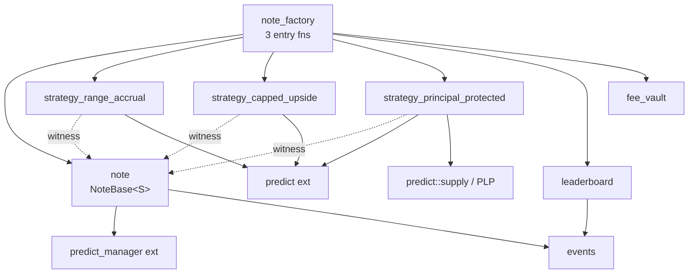

# Structured Note Factory — Architecture Spec

> Track 2 · DeepBook & Prediction Markets · Sui Overflow 2026
> HANDBOOK pillar: **Vaults & Structured Products**
> Date: 2026-06-16 · Network: testnet · Protocol 124 (Sui v1.72.x)
> Source business docs: `BUSINESS_SPEC.md`, `IDEA_REPORT.md`

---

## 0. Locked Design Decisions

| # | Decision | Choice | Rationale |
|---|---|---|---|
| D1 | MVP template count | **3** (Range Accrual, Capped Upside, Principal Protected) | IDEA_REPORT scope; full demo |
| D2 | Note object model | **Hybrid: `NoteBase<phantom S>` + per-strategy witness** | One canonical type for SDK/indexer/Kiosk/Display; per-strategy audit scope; static settlement (regulatory-verifiable, unlike serialized descriptor) |
| D3 | Custody & settlement | **LOCKED (disasm-confirmed 2026-06-16, §1.3)**: Per-Note dedicated **shared** `PredictManager` + `redeem_permissionless` settle (no owner gate) + owner-gated `claim`/`withdraw` | Confirmed valid: `redeem_permissionless` has NO owner check (only `is_settled` gate) → anyone can settle, funds return to manager, settler gets nothing (no MEV). `withdraw` asserts `sender == owner` → only holder is paid. Non-custodial, no shared-pool honeypot, positions always settleable even if keeper dies. |
| D4 | Leaderboard | **On-chain append-only registry (facts) + off-chain indexer ranking** | On-chain stores only immutable facts; ranking recomputable off-chain (no gas/DoS) |

---

## 1. Verified On-Chain Facts (DeepBook Predict, testnet)

All facts below verified via `sui_getNormalizedMoveModulesByPackage` on 2026-06-16. **These override all prior assumptions.**

| Item | Value |
|---|---|
| Predict package | `0xf5ea2b3749c65d6e56507cc35388719aadb28f9cab873696a2f8687f5c785138` |
| `Predict` shared object | `0xc8736204d12f0a7277c86388a68bf8a194b0a14c5538ad13f22cbd8e2a38028a` (global pricing/risk/treasury config) |
| dUSDC type | `0xe95040085976bfd54a1a07225cd46c8a2b4e8e2b6732f140a0fc49850ba73e1a::dusdc::DUSDC` |
| Modules | `constants, i64, market_key, math, oracle, oracle_config, plp, predict, predict_manager, pricing_config, range_key, rate_limiter, registry, risk_config, strike_matrix, treasury_config, vault` |

### 1.1 Key functions (real signatures)

```
predict::mint<T>(&mut Predict, &mut PredictManager, &OracleSVI, MarketKey, amount: u64, &Clock, &mut TxContext) -> ()
predict::mint_range<T>(&mut Predict, &mut PredictManager, &OracleSVI, RangeKey, amount: u64, &Clock, &mut TxContext) -> ()
predict::redeem<T>(&mut Predict, &mut PredictManager, &OracleSVI, MarketKey, amount: u64, &Clock, &mut TxContext) -> ()
predict::redeem_permissionless<T>(&mut Predict, &mut PredictManager, &OracleSVI, MarketKey, amount: u64, &Clock, &mut TxContext) -> ()
predict::redeem_range<T>(&mut Predict, &mut PredictManager, &OracleSVI, RangeKey, amount: u64, &Clock, &mut TxContext) -> ()
predict::supply<T>(&mut Predict, Coin<T>, &Clock, &mut TxContext) -> Coin   // PLP deposit
predict::withdraw<T>(&mut Predict, Coin<T>, &Clock, &mut TxContext) -> Coin // PLP withdraw
predict::create_manager(&mut TxContext) -> ID

predict_manager::new(&mut TxContext) -> ID
predict_manager::deposit(&mut PredictManager, Coin, &TxContext) -> ()
predict_manager::deposit_permissionless(...) 
predict_manager::withdraw(&mut PredictManager, amount: u64, &mut TxContext) -> Coin
predict_manager::position(&PredictManager, MarketKey) -> u64
predict_manager::range_position(&PredictManager, RangeKey) -> u64
predict_manager::balance(&PredictManager) -> u64
predict_manager::owner(&PredictManager) -> address
predict_manager::{increase,decrease}_position / {increase,decrease}_range  // internal, called by predict
```

### 1.2 Critical type facts

- **No `Position` object exists.** Positions are table entries inside `PredictManager.positions` / `range_positions`, keyed by `MarketKey` / `RangeKey`.
- `PredictManager` abilities = **`key` ONLY** (no `store`). Fields: `id, owner, balance_manager, deposit_cap, withdraw_cap, positions, range_positions`. It is the DeepBook BalanceManager-style **trading account**. → **Cannot be wrapped inside another struct.**
- `MarketKey` = `copy, drop, store`; fields `oracle_id, expiry, strike, direction`. Constructors: `market_key::up/down/new`. → **Can be stored in a `vector` field.**
- `RangeKey` = `copy, drop, store`; fields `oracle_id, expiry, lower_strike, higher_strike`.
- `OracleSVI` = `key`; **one shared object per (underlying, expiry)**; fields `svi, settlement_price, status, prices, expiry, underlying_asset`. Status: active / pending_settlement / settled. SVI params readable via `oracle::svi_a/b/m/rho/sigma`, mark via `oracle::compute_price/forward_price/spot_price/binary_price_pair`.
- `plp::PLP` abilities = `drop` only → it is a **witness type**, not an LP token. PLP accounting is internal to `Predict`; `supply`/`withdraw` move `Coin<T>` in/out.

### 1.3 RESOLVED — bytecode disassembly (sui move disassemble v1.73.1, 2026-06-16)

1. **`predict_manager::withdraw` → `assert!(sender == self.owner)`** (owner-gated). `WithdrawCap` is minted into the manager at `new` and used internally; the real gate is sender==owner. `withdraw` disasm: `sender → borrow owner → Eq → BrFalse → Abort(0)`.
2. **`predict_manager::new` → `transfer::share_object`** → manager is a **shared object**; `owner` field = creating sender. `new` is `public(friend)` → must be created via the public `predict::create_manager` wrapper. → manager NOT owned/wrappable; referenced by ID (consistent with §4).
3. **`mint`/`mint_range` ARE owner-gated** (`sender==owner` assert, abort code 1). **`redeem_permissionless` is NOT** — only gate is `oracle::is_settled` (abort code 9); `owner`/`sender` are only packed into the `PositionRedeemed` event, no Eq/abort. Confirmed by contrast with `mint_range`'s explicit owner gate.

**Implication (custody wiring locked):** mint PTB must run with the note holder as `sender` (so `create_manager` sets `owner = holder` and owner-gated `mint` passes). Note is soulbound to that holder. Settlement: anyone calls `redeem_permissionless` (funds → manager); holder calls `claim` (sender==owner → `withdraw` succeeds). No keeper trust, no MEV.

**Residual (oracle attack surface, out of this scope):** `redeem_permissionless` correctness depends on `is_settled`/quoteable-oracle conditions not being cheaply manipulable → settled by the Predict oracle module, audit separately (T5).

---

## 2. System Overview

```
User/KOL/CeFi → Frontend (Next.js PWA) → TS SDK → PTB → Sui Move
                                              ↑ read
On-chain (Move):
  note_factory (3 entry fns) → strategy_{range,capped,pp} (witness) → predict::* / predict_manager::*
  note (NoteBase<S>) · leaderboard (registry+events) · fee_vault (Cap-gated) · events
Off-chain:
  pricing-engine (SVI sub + Monte-Carlo) · backtest-service · indexer (Postgres) · settlement-keeper
  Walrus: term sheet PDF + backtest CSV → blob_id embedded in NoteBase at mint
```

On-chain holds only what must be tamper-proof: manager binding, leg keys, Walrus blob_id, settlement math, mint/settle events. Ranking / backtest / Monte-Carlo are off-chain (recomputable, trustless).

---

## 3. Module Architecture & Dependency



| Module | Responsibility | Why isolated |
|---|---|---|
| `note` | `NoteBase<phantom S>` def, lifecycle, `claim` entry, Walrus binding | Audit core, minimal churn |
| `strategy_*` (×3) | per-template leg composition + payoff/settlement math; provides witness `S` | per-strategy audit scope; add template without touching core |
| `note_factory` | 3 entry fns; orchestrate strategy→manager→note→leaderboard→fee | external API surface |
| `leaderboard` | append-only public-note registry + events | on-chain facts only, ranking off-chain |
| `fee_vault` | 30bps issuance fee / 10% perf share; `FeeAdminCap`-gated | isolate money-flow authority |
| `events` | unified event structs | single indexer source |

**Strategy witness pattern:** `S` is a phantom type provided by each strategy module's one-time witness. `NoteBase<RangeAccrual>` ≠ `NoteBase<PrincipalProtected>` at compile time → impossible to settle one template with another's logic. All share `has store` + common getters → indexer/Kiosk/SDK treat them as one family after generic erasure.

---

## 4. Data Structures (corrected against verified ABI)

```move
// note.move — audit core
// MVP: `key` ONLY (no `store`) = soulbound / non-transferable.
// Reason (review F3): Move cannot read an owned object's current holder on-chain;
// `claim` can only trust `ctx.sender()`, which equals the holder ONLY if the note
// cannot be transferred. `store` would let `public_transfer` move it, breaking both
// the owner-gated payout and the fixed `PredictManager.owner`/`owner_at_mint` binding
// (T6). Add `store` + Kiosk back in v1 once manager-owner reassignment is solved.
public struct NoteBase<phantom S> has key {
    id: UID,
    issuer: address,
    owner_at_mint: address,
    manager_id: ID,                 // dedicated PredictManager (key-only, referenced not wrapped)
    underlying: vector<u8>,         // "BTC"
    legs: vector<MarketKey>,        // copy+store → storable ✅
    range_legs: vector<RangeKey>,
    oracle_ids: vector<ID>,         // one OracleSVI per expiry
    notional: u64,
    mint_ts_ms: u64,
    expiry_ts_ms: u64,
    walrus_blob_id: vector<u8>,     // bound at mint, immutable
    fee_bps: u16,
    is_public: bool,
    status: u8,                     // 0 Active · 1 Settled · 2 Defaulted
    // strategy params via dynamic_field keyed by witness → stable NoteBase layout
}

// strategy_range_accrual.move
// Params carry an explicit `version: u8` for versioned dispatch (review F4):
// dynamic_field protects the PARENT layout, NOT the value struct. Mutating an
// existing Params struct (adding fields) aborts reads of old notes. Rule: existing
// Params are FROZEN; evolution = new versioned param key, never edit in place.
public struct RangeAccrual has drop {}                 // witness
public struct RangeParams has store, copy, drop {
    version: u8,
    lower: u64, upper: u64,
    coupon_bps_per_hour: u16,
    roll_interval_ms: u64,
    accrued_coupon: u64,
}
// strategy_capped_upside.move
public struct CappedUpside has drop {}
public struct CappedParams has store, copy, drop {
    floor_strike: u64, cap_strike: u64, leverage_bps: u16, safety_strike: u64,
}
// strategy_principal_protected.move
public struct PrincipalProtected has drop {}
public struct PPParams has store, copy, drop {
    coupon_strike: u64, upside_bps: u16, plp_supplied: u64,
}
```

**Why MarketKey-as-leg, not Position object:** verified ABI has no Position object; positions live in `PredictManager` keyed by MarketKey. The Note records the keys (descriptor) + the manager ID; quantity per key read live via `predict_manager::position(mgr, key)`.

**Why dynamic field for params:** keeps `NoteBase` binary layout stable across upgrades; strategies evolve independently; reads stay type-safe (key = witness).

---

## 5. Core Flows

### 5.1 Mint (Range Accrual example) — single PTB

```
mint_range_accrual<DUSDC>(
    factory_cfg, &mut Predict, oracles: vector<&OracleSVI>,
    payment: Coin<DUSDC>, lower, upper, tenor_ms, coupon_bps,
    walrus_blob_id, is_public, &Clock, ctx)
  1. fee = notional * fee_bps / 10000 → fee_vault::collect(fee_coin)
  2. mid = predict::create_manager(ctx)                    // public wrapper → shares manager, owner = sender(holder)
     predict_manager::deposit(mgr, remaining_principal, ctx)  // mgr resolved as shared input by mid
  3. strategy_range_accrual::compose():
       for (oracle_k, strike_k) in strikes_in(lower..upper):
           key = market_key::up(oracle_id_k, expiry_k, strike_k)
           predict::mint<DUSDC>(predict, mgr, oracle_k, key, qty_k, clk, ctx)
           legs.push(key)
  4. note = note::new<RangeAccrual>(mid, legs, oracle_ids, walrus_blob_id, ...)
     df::add(note.id, RangeAccrual{}, RangeParams{...})
  5. if is_public: leaderboard::register(&note)            // append-only + event
  6. event::emit(NoteMinted{...})
  7. transfer::public_transfer(note, ctx.sender())
```

All legs mint atomically in one PTB → eliminates leg-risk (the failure that killed Cega). Note `&mut Predict` and each `&OracleSVI` are **shared objects** → mint txs touching the same Predict contend at consensus; mitigate with per-note managers (writes isolated) and notional/leg caps in MVP.

### 5.2 Per-template composition

| Template | Composition | Notes |
|---|---|---|
| Range Accrual | N adjacent-strike long-range binaries (`mint_range`), hourly auto-roll | roll settles accrued coupon; multiple expiries → multiple OracleSVI |
| Capped Upside | long binary call spread (`up` @floor, `down`/inverse @cap) + deep-OTM safety leg | fixed 2+1 legs |
| Principal Protected | `predict::supply` dUSDC into PLP (funds premium) + long deep-OTM call | See PP note below |

**PP yield invariant (review F5).** Future PLP yield does NOT exist at mint, so `assert yield ≥ premium` is impossible. Corrected: at mint, compute premium budget from a **conservative floor yield** read from `risk_config`/`pricing_config`, and `assert plp_supplied * conservative_yield_bps / 10000 >= premium`. Emit the assumed floor yield in `NoteMinted` and write it into the Walrus term sheet. **Compliance: protection is CONDITIONAL on realised PLP yield ≥ floor — never advertise unconditional principal protection.**

### 5.3 Settlement (two-phase; funds never stuck)

```
A. anyone:  predict::redeem_permissionless<DUSDC>(predict, mgr, oracle_k, key_k, qty_k, clk, ctx)
            // settles each leg into mgr balance; works even if keeper is dead
B. owner:   note_factory::claim<S>(note, &mut Predict, oracles, &mut mgr, &Clock, ctx)
            - assert clock.ts >= expiry
            - assert note.manager_id == object::id(mgr)
            - ALL-LEGS-SETTLED invariant (review F2): for every key in legs+range_legs,
              ensure settled. Prefer ATOMIC settle-then-withdraw inside claim:
                for key in legs:       predict::redeem_permissionless(... key ...)
                for key in range_legs: predict::redeem_range(... key ...)
                assert predict_manager::position(mgr, key) == 0  // post-check each
              (sender==holder guaranteed by soulbound, so claim can settle+withdraw atomically)
            - payout = predict_manager::withdraw(mgr, predict_manager::balance(mgr), ctx)
            - perf_fee = max(0, payout - principal*hurdle) * 10% → fee_vault
            - transfer (payout - perf_fee) Coin<DUSDC> to ctx.sender() (== holder, soulbound)
            - delete note UID; emit NoteSettled
```

**Why the all-legs-settled invariant (review F2):** without it, a partially-settled
multi-leg note can be claimed — `withdraw(balance)` pulls only the settled portion, the
note UID is deleted, and the unsettled legs' value is **permanently stranded** (no note
left to reference `manager_id`). `assert manager_id == id(mgr)` alone is insufficient.
Settling all legs *inside* `claim` makes it atomic.

`redeem_permissionless` (standalone, phase A) = the trust guarantee that anyone can
settle even if the holder never claims. `withdraw` is owner-gated = correct (only holder
gets paid). "Permissionless" applies to **settlement**, not **withdrawal**.

### 5.4 Defaulted state liquidation (review F6)

If oracle deviation (T5) or `oracle.status != settled` past a grace period forces
`status = Defaulted`, `claim` takes a fallback path: settle whatever legs are settleable,
then return `predict_manager::balance(mgr)` (settled proceeds + uninvested principal) to
the holder, **no performance fee**. Defaulted = best-effort principal return at current
manager balance — define this explicitly so T5's "safe state" is not vacuous.

---

## 6. Permission System

| Cap | Holder | Power | Why |
|---|---|---|---|
| `FactoryAdminCap` | deployer/DAO | pause minting, set fee_bps, register strategy, set notional cap | emergency control |
| `FeeAdminCap` | treasury | withdraw from fee_vault | money-flow isolation |
| (none) | anyone | `mint_*`, `redeem_permissionless` | non-custodial |

**Admin cap touches NO user funds and NO minted note** — only governance params + emergency pause. This is the core regulatory answer: "admin cannot touch user principal."

**OPEN (Kiosk resale):** `PredictManager.owner` is fixed at creation. If a Note is resold, manager.owner ≠ new holder → `claim` auth breaks. **MVP enforces non-transferability on-chain via `key`-only (no `store`) — soulbound (see §4 NoteBase).** This is mandatory, not optional: Move cannot read an owned object's current holder, so `claim` must trust `ctx.sender()`, which only equals the holder when transfer is impossible. v1+: confirm manager-ownership reassignment (§1.3), then add `store` + Kiosk.

---

## 7. Events & Errors

```move
public struct NoteMinted has copy, drop { note_id, strategy: vector<u8>, issuer, manager_id, notional, expiry_ts, walrus_blob_id, is_public }
public struct NoteSettled has copy, drop { note_id, payout, perf_fee, settled_by }
public struct PublicNoteRegistered has copy, drop { note_id, issuer, template: vector<u8> }
public struct FeeCollected has copy, drop { note_id, kind: u8, amount }
```

Error code ranges: `note` 1xx · `strategy_*` 2xx/3xx/4xx · `factory` 5xx · `leaderboard` 6xx · `fee_vault` 7xx.
Key errors: `ENotExpired`, `EOracleNotSettled`, `EOracleDeviation`, `ENotionalCapExceeded`, `EInsufficientPLPYield`, `ENotOwner`, `EManagerMismatch`.

---

## 8. Integrations

- **Walrus:** TS SDK generates term sheet (MD→PDF) + backtest CSV → `walrus store` (Quilt-pack small blobs) → `blob_id` injected into mint PTB. On-chain stores 32-byte blob_id; frontend verifies by resolving Walrus URL. Term sheet is bound at mint = compliance core.
- **Leaderboard:** on-chain append-only registry stores only facts (note_id, issuer, template, walrus_blob_id). Off-chain indexer computes realised APR ranking. No mutable on-chain ranking (avoids gas/DoS).
- **Settlement keeper:** self-hosted fallback bot polls expiring notes, calls `redeem_permissionless`. Because permissionless, a dead keeper never strands funds. **No hard dependency on external Keeper Network.**
- **Pricing engine (off-chain TS):** subscribes to oracle/SVI updates; computes payoff diagrams + Monte-Carlo for wizard; cross-checks BTC mark vs Pyth.

---

## 9. Data Layer

- **gRPC** (GA) for current note/manager state reads.
- **GraphQL** (beta) for frontend queries.
- **Custom indexer** (Postgres, `ConcurrencyConfig` — `Processor::FANOUT` removed in Protocol 124) for leaderboard ranking, KOL attribution, historical NAV CSV.
- JSON-RPC deprecated (removal Apr 2026) — used here only for one-off ABI introspection during design.

---

## 10. Security / Threat Model (≤5 vectors per red-team rule)

| # | Vector | Defense |
|---|---|---|
| 1 | Access-control bypass | admin cap cannot touch user funds/notes; worst case = self-limiting mint pause |
| 2 | Integer overflow | fee/coupon/payoff via checked math + u128 intermediates; notional cap bounds inputs |
| 3 | Object manipulation | `NoteBase has key`; `claim` consumes whole note + asserts `manager_id` match; cannot extract collateral alone |
| 4 | Economic / settlement MEV | proceeds forced to `owner_at_mint`; permissionless caller gets only gas (optional fixed tip from pre-funded budget) |
| 5 | Oracle manipulation (the Ribbon killer) | settle reads Predict SVI **and** cross-checks Pyth mark; deviation > threshold → revert into `Defaulted` safe state; require `oracle.status == settled` |

Full threat model: `docs/security/threat-model.md`.

---

## 11. Testing Strategy

- Per-strategy payoff unit tests incl. edges: range boundary, simultaneous-expiry, insufficient PLP premium, zero notional.
- Monte-Carlo cross-check vs off-chain pricing engine.
- PTB integration tests (mint→settle round-trip) against testnet Predict package.
- **Monkey testing** (project rule): extreme strikes, zero notional, redeem-before-expiry, double-redeem, double-claim, oracle-not-settled.
- `sui move test` must pass before every commit.

---

## 12. Deployment

- Stages: devnet → testnet → mainnet.
- `note_factory` uses `UpgradeCap`; `note` core kept layout-stable (dynamic fields absorb strategy evolution).
- DeepBook must be declared **explicitly** in `Move.toml` (since v1.47). Predict package has no public git source → depend via published package ID / `published-at` override:

```toml
[dependencies]
Sui = { git = "https://github.com/MystenLabs/sui.git", subdir = "crates/sui-framework/packages/sui-framework", rev = "framework/testnet" }
# Predict: no public source; use published-at override against
# 0xf5ea2b3749c65d6e56507cc35388719aadb28f9cab873696a2f8687f5c785138
```

---

## 13. Gas Optimization

- Multi-leg PTB is the gas hotspot (range accrual up to 24 legs) → MVP caps leg count via notional cap.
- Per-note managers isolate `&mut PredictManager` writes (no cross-note contention); only shared `&mut Predict` + `&OracleSVI` contend — acceptable at MVP volume.
- **Multi-expiry contention (review F7):** each `OracleSVI` is a per-(underlying,expiry) shared object that must be declared at PTB start. A cross-expiry Range Accrual note locks N OracleSVI shared objects + global `Predict` in one tx → consensus cost scales with expiry count, not just "Predict + one oracle". **Hard cap distinct expiries per note (MVP ≤3)**; frontend statically enumerates the required OracleSVI IDs when building the PTB (see §14.2).
- `claim` settlement reads owned Note → fast path.

---

## 14. Next Steps

1. **Disassemble `predict_manager::{new, withdraw, deposit}` + `predict::mint`** to resolve §1.3 open items (withdraw auth, manager shared-vs-owned). This gates the exact custody wiring (§5.3, §6).
2. Confirm OracleSVI object IDs per (BTC, expiry) on testnet for the wizard's strike enumeration.
3. Scaffold project (`sui-dev-agents:init`) and implement `note` + `strategy_range_accrual` first (D1 flagship, full issue→settle loop).

---

*Architecture spec v1 — corrected against verified testnet ABI 2026-06-16.*
